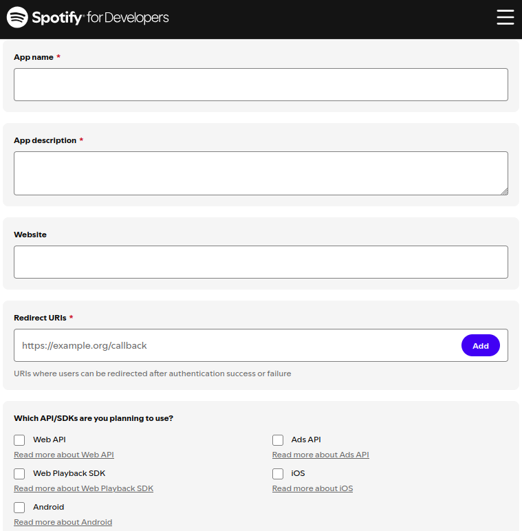
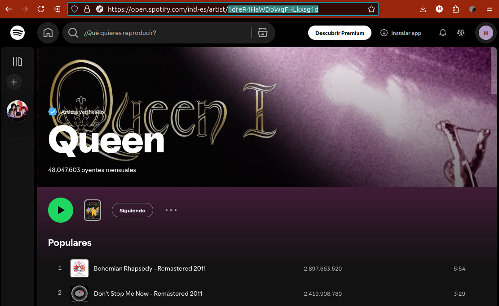

# Práctica de API request

Este repositorio contiene el enunciado de la práctica de API request

## **Modalidad de presentación**

1. Debes crear un nuevo repositorio en tu cuenta de GitHub a partir de este Template. Para ello utiliza el botón "Utilizar este template"
2. Luego en tu repositorio, debes editar el archivo `project.ipynb` que se encuentra en el directorio `notebooks` para resolver el proyecto.
3. Finalmente, presentar en WebAsignatura el enlace de tu repositorio.

## **Criterios de evaluación**

- **PEP 8:** El código debe seguir las pautas de estilo de **PEP 8**.
- **Markdown:** El notebook `project.ipynb` debe estar bien documentado usando **Markdown** para explicar cada paso y los resultados obtenidos.
- **Funcionalidad:** Todas las tareas deben estar resueltas correctamente.

## Enunciado

### **Introducción**

Eres parte de un equipo de análisis de datos encargado de investigar tendencias en la industria de la música. Por ello, deberás recolectar datos de API relacionadas con la industria.

Tu objetivo es **consumir** la API de Spotify para obtener datos de tendencias musicales.

### **Tarea 1**

Crea una aplicación para desarrolladores de Spotify mediante el portal para desarrolladores.

### **Tarea 2**

Conéctate con la API de Spotify utilizando Python.
  
### **Tarea 3**

De tu artista favorito recupera el top 10 de sus canciones, generando una lista de diccionarios que incluirán las claves 'song', 'popularity' y 'duration'. Para ello, tendrás que buscar el ID del artista.

Salida esperada:
```python
[{'song': 'Nos Siguen Pegando Abajo', 'popularity': 67, 'duration': 206720},
 {'song': 'Demoliendo Hoteles', 'popularity': 66, 'duration': 135973},
 {'song': 'No Voy en Tren', 'popularity': 63, 'duration': 181600},
 {'song': 'Promesas Sobre El Bidet', 'popularity': 64, 'duration': 164360},
 {'song': 'Hablando a Tu Corazón', 'popularity': 63, 'duration': 255266},
 {'song': 'No Me Dejan Salir', 'popularity': 62, 'duration': 263200},
 {'song': 'Raros Peinados Nuevos', 'popularity': 60, 'duration': 214760},
 {'song': 'Tu Amor', 'popularity': 60, 'duration': 186466},
 {'song': 'Rezo por Vos', 'popularity': 59, 'duration': 269053},
 {'song': 'Los Dinosaurios', 'popularity': 57, 'duration': 208093}]
```

## **Pistas para la implementación**:

### Paso 1 - Crear una cuenta de desarrollador en Spotify

Antes de comenzar a programar, necesitas tener acceso a las credenciales de desarrollador de Spotify. Visita: https://developer.spotify.com

- Inicia sesión con tu cuenta de Spotify (o crea una si aún no tienes una).
- Ve a Dashboard y haz clic en Create an App. Completa los campos requeridos. En Redirect URI, escribe: https://localhost/



Después que hayas creado la app, ingresa en la configuración para copiar tu Client ID y Client Secret. Los usarás más adelante para autenticarte ante la API.

### Paso 2 - Variables de Entorno

Crea un archivo con el nombre `.env` en el directorio raíz del proyecto. Asegúrate de que contenga las siguientes variables con tus credenciales de Spotify (reemplaza el contenido con tus propios datos):

```text
CLIENT_ID=your_client_id
CLIENT_SECRET=your_client_secret
```

> ⚠️ Es importante que coloques tus datos en las variables de entorno para evitar exponer tus credenciales si subes el proyecto a un repositorio.

Ahora, en el archivo project.ipynb, agrega el siguiente código para leer las variables de entorno:

```python
import os
from dotenv import load_dotenv

# load the .env file variables
load_dotenv()

# Get credential values
client_id = os.getenv("CLIENT_ID")
client_secret = os.getenv("CLIENT_SECRET")
```

Con esto, tus credenciales estarán listas para ser utilizadas en la autenticación con la API de Spotify.

### Paso 3 - Inicializar la librería de Spotipy

- Primero debes instalar la librería `Spotipy` y en PyCharm puedes realizarlo de dos maneras:
  - Desde la terminal ejecutando el comando `pip install spotipy`
  - Desde Python Package, buscando spotipy y haciendo click en `install`
- Segundo, en el archivo `project.ipynb` debes importar spotipy y realizar la conexión con la API

```python
import spotipy
from spotipy.oauth2 import SpotifyClientCredentials

auth_manager = SpotifyClientCredentials(client_id=client_id, client_secret=client_secret)
spotify = spotipy.Spotify(auth_manager=auth_manager)
```

> Documentación: Puedes guiarte con la siguiente documentación [https://spotipy.readthedocs.io/](https://spotipy.readthedocs.io/)

### Paso 4: Ya tienes acceso a la API

Puedes comenzar a interactuar con la API de Spotify.

### Paso 5: Encontrando el Artist-ID

El ID de un artista es su identificador que puedes obtenerlo de la dirección web que tiene el artista en Spotify.

Ejemplo:


